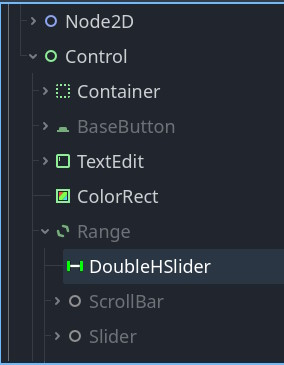
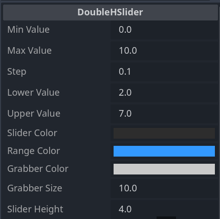
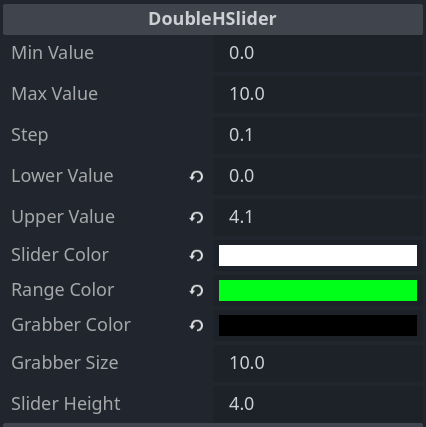
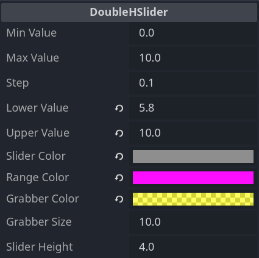
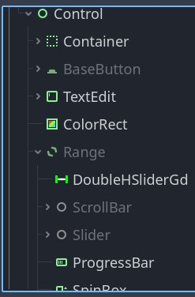
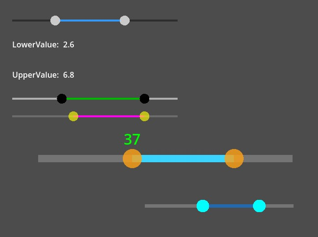
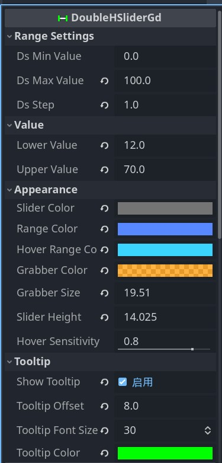

# Double HSlider for Godot 4.4_双向滑动块

### ▶ [C# version](#-double_hslider-c-version)

### ▶ [gd version](#-double_hslider_gd-gd-version)

---

### ▶ Double_HSlider (C# version)

### ● Tutorial

1. Download the "addons" directory and enable the "Double HSlider" plugin.

2. Add child nodes in the scene: Control-->Range-->DoubleHSlider.

3. Connect the "ValueChanged" signal of the control and receive two values, LowerValue and UpperValue.

4. Run the project and enjoy.



### ● Features

1. Coding by C#, so the Godot .Net version is required to compile this plugin.(Maybe someday I will write a gdscript version.)

2. This is runtime version, so the control can only be used during project execution. The editor version is currently being planned.

3. Double slider control that can obtain two values, lower and upper.

4. Each part of the control can change its color, transparency, and even shape (rewriting the drawing code in the _daraw() function).

5. Ensure that smaller values do not exceed larger values. There are numerical constraints between MinValue, MaxValue, Step, LowerValue, and UpperValue.

6. Bi directional updates between user interface and parameters.

  

7. Sample test:

```cs
using Godot;

public partial class Test : Control
{
    [Export]
    DoubleHSlider doubleHSlider;
    [Export] Label lowerV, upperV;

    public override void _Ready()
    {
        doubleHSlider.ValueChanged += DoubleSlider_ValueChanged;
    }

    private void DoubleSlider_ValueChanged(float lower, float upper)
    {
        lowerV.Text = lower.ToString();
        upperV.Text = upper.ToString();
    }
}
```

---

### ▶ Double_HSlider_gd (gd version)



### ● Features

1. Coding by gdscript.

2. This is runtime version, so the control can only be used during project execution.

3. Double slider control that can obtain two values, lower and upper.

4. Each part of the control can change its color and transparency, including Slider, Range, Hover, Grabber, and Tooltip colors.

5. There are strong numerical constraints between MinValue, MaxValue, Step, LowerValue, and UpperValue.

6. Bi directional updates between user interface and parameters.

7. Useful signals:

```gdscript
signal drag_started()
signal drag_ended()
signal ds_values_changed(lower: float, upper: float)
signal lower_value_changed(value: float)
signal upper_value_changed(value: float)
```



8. Sample test:

```gdscript
extends Control

@export var double_h_slider: DoubleHSliderGd
@export var lower_v: Label
@export var upper_v: Label

func _ready():
    double_h_slider.ds_values_changed.connect(_on_double_slider_value_changed)    
    double_h_slider.lower_value_changed.connect(_on_lower_value_changed)
    double_h_slider.upper_value_changed.connect(_on_upper_value_changed)

func _on_double_slider_value_changed(lower: float, upper: float):
    lower_v.text = str(lower)
    upper_v.text = str(upper)
    print(lower)

func _on_lower_value_changed(lower:float):
    print(lower)

func _on_upper_value_changed(upper:float):
    print(upper)
```

---

---

### ● Road Map 计划

1. Fix bug and Adapt to various application scenarios.(Done in gd version)

2. Create a runtime version of gdscript.(Done)

3. Create a gdscript editor version.(Doing...)
- If you have any issues or bugs, please submit a 'New issue'.
---
[Back to Top](#-double_hslider-c-version)
